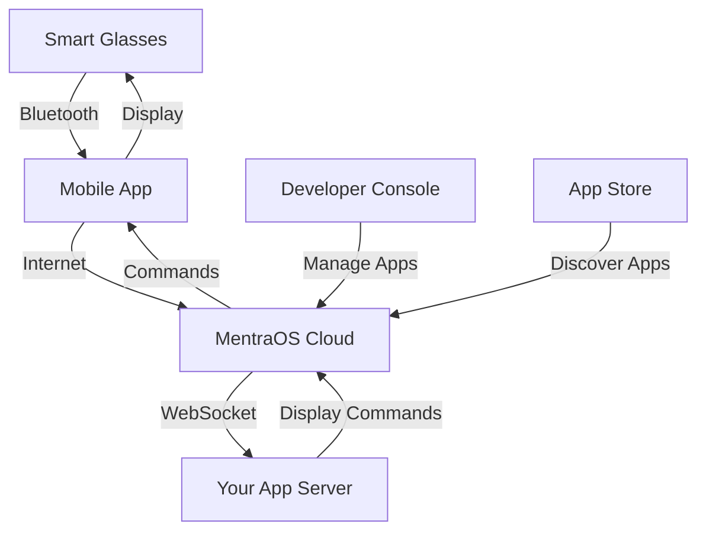

# Complete Beginner's Setup Guide

Welcome to MentraOS! This comprehensive guide will take you from zero to having a fully functional smart glasses development environment. Whether you're a complete beginner or have some programming experience, this guide will walk you through every step.

## Table of Contents

1. [What is MentraOS?](#what-is-mentraos)
2. [Understanding the Architecture](#understanding-the-architecture)
3. [Prerequisites & System Requirements](#prerequisites--system-requirements)
4. [Step 1: Install Development Tools](#step-1-install-development-tools)
5. [Step 2: Set Up Your Development Environment](#step-2-set-up-your-development-environment)
6. [Step 3: Get Smart Glasses (Optional)](#step-3-get-smart-glasses-optional)
7. [Step 4: Create Your First App](#step-4-create-your-first-app)
8. [Step 5: Test Your Setup](#step-5-test-your-setup)
9. [Troubleshooting Common Issues](#troubleshooting-common-issues)
10. [Next Steps](#next-steps)

## What is MentraOS?

MentraOS is an open-source operating system and development platform for smart glasses. Think of it as "Android for smart glasses" - it provides:

- **Cross-compatibility**: Your apps work on any supported smart glasses
- **Easy development**: Use familiar web technologies (TypeScript, React)
- **Real-time communication**: Apps can respond to voice, gestures, and sensors
- **Cloud integration**: Powerful backend services for AI, storage, and more

### Why Smart Glasses?

Smart glasses are the next evolution of personal computing:
- **Hands-free interaction**: Perfect for when your hands are busy
- **Always-available information**: Get help without looking at your phone
- **Augmented reality**: Overlay digital information on the real world
- **Accessibility**: Help people with disabilities access technology

## Understanding the Architecture

Before diving in, let's understand how MentraOS works:



### Key Components:

1. **Smart Glasses**: The physical device (camera, display, microphone, speakers)
2. **Mobile App**: Runs on your phone, connects glasses to the cloud
3. **MentraOS Cloud**: Backend services that handle communication and AI
4. **Your App Server**: Your custom application that users interact with
5. **Developer Console**: Web interface to manage your apps
6. **App Store**: Where users discover and install apps

## Prerequisites & System Requirements

### Required Knowledge
- **Basic programming**: Familiarity with any programming language
- **Command line**: Comfortable with terminal/command prompt
- **Web concepts**: Understanding of HTTP, APIs, and web servers

### System Requirements

#### For App Development (Minimum)
- **Operating System**: Windows 10+, macOS 10.15+, or Ubuntu 18.04+
- **RAM**: 8GB minimum, 16GB recommended
- **Storage**: 10GB free space
- **Internet**: Stable broadband connection

#### For Mobile App Development
- **Android Studio**: For Android development
- **Xcode**: For iOS development (macOS only)
- **Physical device**: Android phone or iPhone for testing

#### For Smart Glasses Development
- **Compatible glasses**: See [supported devices](#supported-smart-glasses)
- **Android phone**: Required for glasses pairing

## Step 1: Install Development Tools

### 1.1 Install Node.js

**Why**: MentraOS apps are built with TypeScript/JavaScript

**Windows:**
1. Go to [nodejs.org](https://nodejs.org)
2. Download the LTS version (18.x or later)
3. Run the installer and follow the prompts
4. Verify installation:
   ```bash
   node --version
   npm --version
   ```

**macOS:**
```bash
# Using Homebrew (recommended)
brew install node

# Or download from nodejs.org
```

**Linux (Ubuntu/Debian):**
```bash
# Using NodeSource repository
curl -fsSL https://deb.nodesource.com/setup_18.x | sudo -E bash -
sudo apt-get install -y nodejs

# Verify installation
node --version
npm --version
```

### 1.2 Install Bun (Recommended)

**Why**: Bun is faster than npm and is the preferred package manager for MentraOS

```bash
# Install Bun
curl -fsSL https://bun.sh/install | bash

# Restart your terminal, then verify
bun --version
```

### 1.3 Install Git

**Why**: Required for cloning repositories and version control

**Windows:**
- Download from [git-scm.com](https://git-scm.com)
- Run installer with default settings

**macOS:**
```bash
# Using Homebrew
brew install git

# Or install Xcode Command Line Tools
xcode-select --install
```

**Linux:**
```bash
sudo apt update
sudo apt install git
```

### 1.4 Install a Code Editor

**Recommended: Visual Studio Code**

1. Download from [code.visualstudio.com](https://code.visualstudio.com)
2. Install these extensions:
   - TypeScript and JavaScript Language Features
   - Prettier - Code formatter
   - ESLint
   - GitLens

## Step 2: Set Up Your Development Environment

### 2.1 Create a Development Directory

```bash
# Create a dedicated folder for MentraOS development
mkdir mentraos-development
cd mentraos-development
```

### 2.2 Clone the MentraOS Repository

```bash
# Clone the main repository
git clone https://github.com/Mentra-Community/MentraOS.git
cd MentraOS

# Verify the structure
ls -la
```

You should see folders like:
- `mobile/` - Mobile app source code
- `cloud/` - Backend services
- `asg_client/` - Smart glasses client
- `docs/` - Documentation

### 2.3 Set Up Mobile App Development

**For Android Development:**

1. **Install Android Studio:**
   - Download from [developer.android.com](https://developer.android.com/studio)
   - Install with default settings
   - Open Android Studio and complete the setup wizard

2. **Install Android SDK:**
   - Open Android Studio
   - Go to Tools → SDK Manager
   - Install Android 13 (API 33) or later
   - Install Android SDK Build-Tools

3. **Set up environment variables:**
   
   **Windows:**
   ```cmd
   # Add to System Environment Variables
   ANDROID_HOME=C:\Users\%USERNAME%\AppData\Local\Android\Sdk
   # Add to PATH
   %ANDROID_HOME%\platform-tools
   %ANDROID_HOME%\tools
   ```

   **macOS/Linux:**
   ```bash
   # Add to ~/.bashrc or ~/.zshrc
   export ANDROID_HOME=$HOME/Library/Android/sdk
   export PATH=$PATH:$ANDROID_HOME/platform-tools
   export PATH=$PATH:$ANDROID_HOME/tools
   ```

**For iOS Development (macOS only):**

1. **Install Xcode:**
   - Download from Mac App Store
   - Install Xcode Command Line Tools:
     ```bash
     xcode-select --install
     ```

2. **Install CocoaPods:**
   ```bash
   sudo gem install cocoapods
   ```

### 2.4 Set Up Cloud Development

```bash
# Navigate to cloud directory
cd cloud

# Install dependencies
bun install

# Create environment file
cp .env.example .env
```

**Note**: For external contributors, you'll need to set up accounts with various services. See the [Local Development Setup](local-setup) guide for detailed instructions.

## Step 3: Get Smart Glasses (Optional)

### Supported Smart Glasses

| Device | Type | Display | Camera | Price Range | Best For |
|--------|------|---------|--------|-------------|----------|
| **Mentra Live** | Android-based | No | Yes | $200-400 | Camera apps, streaming |
| **Even Realities G1** | HUD | Yes | No | $800-1200 | Display apps, AR |
| **Mentra Mach 1** | HUD | Yes | No | $600-900 | Display apps, productivity |
| **Vuzix Z100** | HUD | Yes | No | $1000+ | Enterprise apps |

### Choosing Your First Glasses

**For beginners, we recommend:**

1. **Mentra Live** - Best for learning camera-based development
2. **Even Realities G1** - Best for learning display-based development

**If you don't have glasses yet:**
- You can still develop and test apps using the mobile app
- Use the simulator mode for basic testing
- Consider borrowing or renting glasses for initial development

### Setting Up Your Glasses

**For Mentra Live:**
1. Charge the glasses fully
2. Download MentraOS mobile app
3. Follow the in-app pairing instructions
4. Connect to WiFi through the app

**For HUD glasses:**
1. Charge the glasses
2. Download MentraOS mobile app
3. Pair via Bluetooth
4. Calibrate the display if prompted

## Step 4: Create Your First App

### 4.1 Choose a Starting Template

We'll use the Live Captions example - it's perfect for beginners:

```bash
# Create a new app from template
gh repo create my-first-mentraos-app --template Mentra-Community/MentraOS-Cloud-Example-App

# Clone your new repository
git clone https://github.com/YOUR_USERNAME/my-first-mentraos-app.git
cd my-first-mentraos-app

# Install dependencies
bun install
```

### 4.2 Set Up Your App

1. **Create environment file:**
   ```bash
   cp .env.example .env
   ```

2. **Edit the .env file:**
   ```env
   PORT=3000
   PACKAGE_NAME=com.yourname.myfirstapp
   MENTRAOS_API_KEY=your_api_key_here
   ```

3. **Register your app:**
   - Go to [console.mentra.glass](https://console.mentra.glass)
   - Sign in with your account
   - Click "Create App"
   - Use the package name from your .env file
   - Copy the API key to your .env file

### 4.3 Run Your App

```bash
# Start the development server
bun run dev

# In another terminal, expose your app to the internet
ngrok http 3000
```

### 4.4 Test Your App

1. **Install MentraOS mobile app** on your phone
2. **Pair your glasses** (if you have them)
3. **Open the MentraOS app** and look for your app
4. **Launch your app** and test the functionality

## Step 5: Test Your Setup

### 5.1 Verify Mobile App Development

```bash
# Navigate to mobile directory
cd ../mobile

# Install dependencies
npm install

# For iOS (macOS only)
cd ios && pod install && cd ..

# Start the development server
npm start

# In another terminal, run on device
npm run android  # or npm run ios
```

### 5.2 Verify Cloud Development

```bash
# Navigate to cloud directory
cd ../cloud

# Start development environment
bun run dev

# Check if services are running
curl http://localhost:8002/health
```

### 5.3 Test App Integration

1. **Create a simple test app** that displays "Hello World"
2. **Deploy it locally** using ngrok
3. **Register it** in the developer console
4. **Test it** on your mobile app and glasses

## Troubleshooting Common Issues

### Issue: "Command not found" errors

**Solution:**
- Restart your terminal after installing tools
- Check your PATH environment variable
- Verify installations with `--version` flags

### Issue: Android Studio setup problems

**Solution:**
- Ensure Java SDK 17 is installed
- Check ANDROID_HOME environment variable
- Run Android Studio as administrator (Windows)

### Issue: Bun installation fails

**Solution:**
- Try the alternative installation method:
  ```bash
  npm install -g bun
  ```
- Check your internet connection
- Ensure you have Node.js installed first

### Issue: Mobile app won't build

**Solution:**
- Clean and rebuild:
  ```bash
  cd mobile
  npm run clean
  npm install
  npm run android
  ```
- Check Android SDK installation
- Verify device is connected and authorized

### Issue: Cloud services won't start

**Solution:**
- Check if ports 3000 and 8002 are available
- Verify Docker is running (if using Docker)
- Check the .env file configuration
- Look at the logs for specific error messages

### Issue: Glasses won't pair

**Solution:**
- Ensure Bluetooth is enabled
- Restart both the glasses and mobile app
- Check if glasses are in pairing mode
- Try forgetting and re-pairing the device

### Issue: App not appearing in MentraOS

**Solution:**
- Verify ngrok is running and accessible
- Check the app registration in developer console
- Ensure the package name matches exactly
- Restart the MentraOS mobile app

## Next Steps

Congratulations! You now have a complete MentraOS development environment. Here's what to do next:

### 1. Explore the Documentation
- [Core Concepts](core-concepts) - Understand sessions, events, and app lifecycle
- [Events](events) - Learn about user interactions and sensor data
- [Layouts](layouts) - Create visual experiences on smart glasses
- [Permissions](permissions) - Access device capabilities securely

### 2. Try More Examples
- [Example Apps](example-apps) - Explore different app types
- [Build From Scratch](getting-started) - Create apps from the ground up
- [Advanced Features](tools) - Implement AI tools and webviews

### 3. Join the Community
- [Discord Server](https://mentra.glass/discord) - Get help and share ideas
- [GitHub Discussions](https://github.com/Mentra-Community/MentraOS/discussions) - Ask questions
- [Contributing Guide](contributing) - Contribute to the project

### 4. Build Your First Real App
- Start with a simple idea (e.g., a note-taking app)
- Use the examples as a starting point
- Test on real devices
- Share your creation with the community

### 5. Learn Advanced Topics
- [Deployment](railway-deployment) - Deploy your apps to production
- [Hardware Integration](hardware-requirements) - Work with different device capabilities
- [Performance Optimization](core-concepts) - Make your apps faster and more efficient

## Getting Help

If you run into issues:

1. **Check the troubleshooting section** above
2. **Search existing issues** on GitHub
3. **Ask on Discord** - the community is very helpful
4. **Create a new issue** if you can't find a solution
5. **Read the logs** - they often contain helpful error messages

## Additional Resources

- [MentraOS Website](https://mentra.glass) - Official website
- [Developer Console](https://console.mentra.glass) - Manage your apps
- [App Store](https://apps.mentra.glass) - Discover existing apps
- [GitHub Organization](https://github.com/Mentra-Community) - Source code and examples

---

**Welcome to the future of computing!** 🚀

You're now ready to build amazing smart glasses applications. Start small, experiment often, and don't hesitate to ask for help. The MentraOS community is here to support you on your journey.
